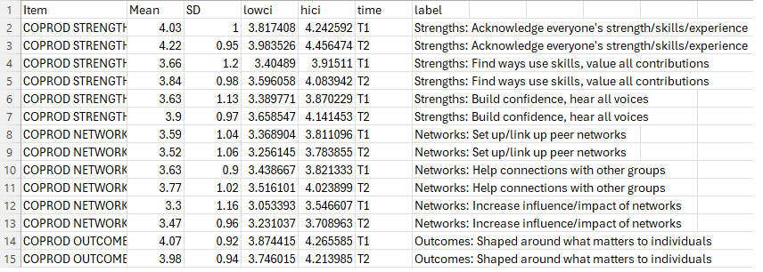
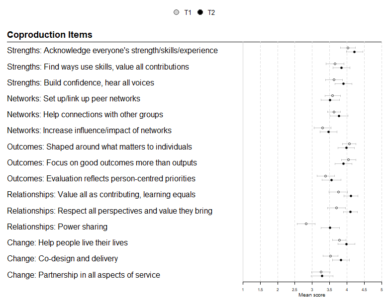

Coefficient Plot code

This came out of a desire to make nice looking coefficient plots with confidence intervals, for more than one group in data. In our case, it was survey data that fed into some papers in press (references to come). We wanted to compare mean scores over time, including their confidence intervals. This code could, though, also be used to graph regression coefficients or any other set of values with confidence intervals and labels.

The data we used were formatted into a CSV as such:

Item is the original survey item, mean is the mean score on the survey at the given timepoint, SD is the standard deviation (not used here), lowci and hici are the lower and upper 95% confidence intervals, time is our grouping variable (one row per item per timepoint), and label is the label in shorter form to appear on the plot. I haven't figured out a way to wordwrap longer labels on this plot but I am welcome to suggestions.

The code produces the following plot when used with this data:

The code is commented so a beginning user can run it, but please don't hesitate to contact me if you need help.
